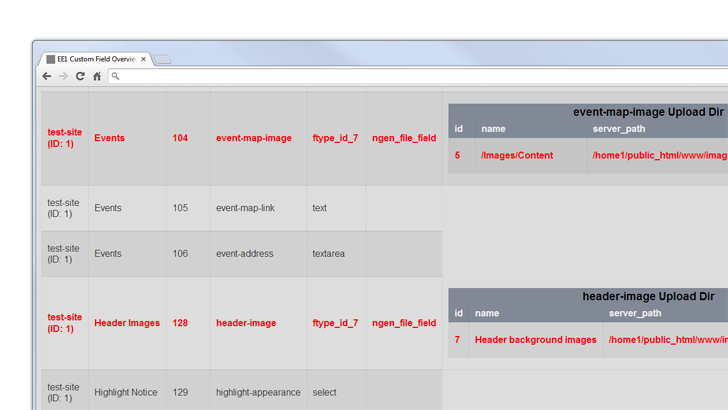

Upgrade EE1 nGen File Fields
============================

ExpressionEngine 1.x template code. Displays overview of all custom fields and displays the MySQL queries that will:

1. Convert EE1 nGen File fields (both custom fields and Matrix columns) to text fields
2. Update data in said fields to comply with native EE2 File field requirements
3. Convert said fields to native EE2 File fields

**This template does NOT make any changes to your database. It only displays information about your EE1 site's custom fields that will aid you in the EE1->EE2 upgrade process.**

Requirements:

- EE 1.7.x (tested on 1.7.1; may work on earlier versions)
- FieldFrame (1.4+)
- nGen File Field (tested on 1.0.1 and 1.0.2)
- (if applicable) Matrix 1.3.5 (the free version) - does NOT work with Matrix 1.5 (the commercial version).

To use:

1. Paste the code from the included .PHP file (found under /template/) into an EE1 template.
2. Enable PHP for the template (input or output).
3. View the template in a browser

You will be shown a table with all the custom fields from your EE1 install (across all MSM sites as well). For each nGen File field, whether standalone or as a Matrix column, detailed information with be displayed regarding the Upload Destination selected for that field:

All the MySQL queries to update field data to the format required by the native EE2 File field are displayed in one place at the bottom of the page, to make it easy to run them all at once:

### IMPORTANT: Save this template's output (what you see in the browser) BEFORE beginning the EE1->EE2 upgrade process. It must be run under EE1, before switching the nGgen File fields over to plain text fields.

Attention Designers and Code Junkies: The codebase and its output aren't anything fancy. Imagine someone calling it "functional" through gritted teeth, and you'll get the idea. If you want to improve anything, be my guest - that's why this is here on GitHub. I'll gladly merge pull requests you send in, but don't expect much more development on this myself - it's to make my life easier when I'm asked to upgrade the 2-3 remaining EE1 sites I maintain, and not much more than that.
